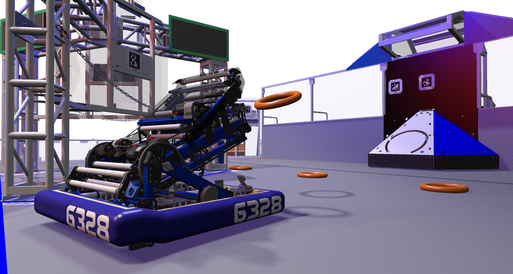

# Crescendo Tour — Meet Presto

*Team 6328 Mechanical Advantage's 2024 Crescendo robot — the canonical AdvantageKit reference, and the shooter that anchors every flywheel-and-feedforward lesson in the curriculum.*

<figure class="r3d-fig">
<svg viewBox="0 0 780 280" role="img" aria-label="A game piece enters Presto through the intake, is indexed by the rollers, and is launched by two flywheels; the arm sets the launch angle and the swerve drive aims the whole robot." style="max-width:100%;height:auto;color:inherit">
  <defs>
    <marker id="pa" viewBox="0 0 10 10" refX="9" refY="5" markerWidth="7" markerHeight="7" orient="auto-start-reverse">
      <path d="M 0 0 L 10 5 L 0 10 z" fill="currentColor"/>
    </marker>
  </defs>

  <!-- the game-piece path -->
  <rect x="30"  y="110" width="140" height="58" rx="3" fill="none" stroke="currentColor" stroke-width="1.5"/>
  <text x="100" y="134" text-anchor="middle" font-size="13" fill="currentColor" font-weight="600">Intake</text>
  <text x="100" y="152" text-anchor="middle" font-size="11" fill="currentColor" opacity="0.7">rollers, floor</text>

  <rect x="245" y="110" width="140" height="58" rx="3" fill="none" stroke="currentColor" stroke-width="1.5"/>
  <text x="315" y="134" text-anchor="middle" font-size="13" fill="currentColor" font-weight="600">Indexer</text>
  <text x="315" y="152" text-anchor="middle" font-size="11" fill="currentColor" opacity="0.7">holds until ready</text>

  <rect x="460" y="110" width="140" height="58" rx="3" fill="#C8791A" fill-opacity="0.12" stroke="#C8791A" stroke-width="2"/>
  <text x="530" y="134" text-anchor="middle" font-size="13" fill="currentColor" font-weight="600">Flywheels</text>
  <text x="530" y="152" text-anchor="middle" font-size="11" fill="currentColor" opacity="0.7">two, ~3000 RPM</text>

  <line x1="170" y1="139" x2="238" y2="139" stroke="currentColor" stroke-width="1.5" marker-end="url(#pa)"/>
  <line x1="385" y1="139" x2="453" y2="139" stroke="currentColor" stroke-width="1.5" marker-end="url(#pa)"/>
  <line x1="600" y1="139" x2="700" y2="139" stroke="#C8791A" stroke-width="2" marker-end="url(#pa)"/>

  <text x="204" y="130" text-anchor="middle" font-size="10.5" fill="currentColor" opacity="0.75">picked up</text>
  <text x="419" y="130" text-anchor="middle" font-size="10.5" fill="currentColor" opacity="0.75">fed in</text>
  <text x="650" y="130" text-anchor="middle" font-size="10.5" fill="currentColor" opacity="0.75">launched</text>
  <text x="740" y="143" text-anchor="middle" font-size="12" fill="currentColor" font-weight="600">Goal</text>

  <!-- what aims it -->
  <rect x="460" y="24" width="140" height="46" rx="3" fill="none" stroke="currentColor" stroke-width="1.5" stroke-dasharray="4 3"/>
  <text x="530" y="52" text-anchor="middle" font-size="12.5" fill="currentColor">Arm (pivot)</text>
  <line x1="530" y1="70" x2="530" y2="103" stroke="currentColor" stroke-width="1.5" stroke-dasharray="4 3" marker-end="url(#pa)"/>
  <text x="612" y="92" text-anchor="middle" font-size="10.5" fill="currentColor" opacity="0.75">sets angle</text>

  <rect x="30"  y="212" width="570" height="46" rx="3" fill="none" stroke="currentColor" stroke-width="1.5" stroke-dasharray="4 3"/>
  <text x="315" y="240" text-anchor="middle" font-size="12.5" fill="currentColor">Swerve drive — aims the whole robot at the goal</text>
</svg>
<figcaption>Presto is a <strong>shooter</strong>. One game piece follows one path, and the only thing that has to be exactly right is flywheel speed — the arm and the drivetrain just point it. That is why the flywheel is the mechanism lesson 10 uses to teach telemetry: it has a single number worth plotting.</figcaption>
</figure>

---

## The game: Crescendo 2024

Crescendo was FRC's 2024 season — a shooter game built around foam donut "notes." Robots picked notes up from the floor, aimed with a pivoting shooter, and fired them into the **speaker** (a high goal at the back of the field) from variable distances. The **amp** (a low, side-loading goal) and the **trap** (a climbing-into-a-chimney mechanism on the stage) added extra scoring paths for robots that wanted to bring more mechanisms to the party.

Presto's whole identity is in that core loop: *spin two wheels really fast; aim with the pivot; push notes in with the rollers.* If you can read Presto's flywheels package, you can read every shooter in FRC.

<figure markdown="span">

<figcaption>Presto on the Crescendo field. The orange rings are Notes, the scaffold on the left is the Stage with its Chain, and the blue structure on the right is the Speaker it shoots into. Render by <a href="https://github.com/Mechanical-Advantage/RobotCode2024Public">FRC 6328</a>, MIT licensed.</figcaption>
</figure>

## Play with the shooter

The two things that decide where a Note lands are the pivot angle and the flywheel
speed. Drag them and watch what happens — the slider limits and the presets are the
same numbers as `Constants.Flywheels` in your project.

Notice that the wheel surface speed, not the RPM, is what actually throws the ring — a
bigger wheel at the same RPM throws harder. That is why lesson 14 asks you to hold a
*speed* rather than a *motor output*.

## Watch it play

Reading the code is one thing; watching what the code produces is another. These are
real matches from 6328's 2024 season, and each one is worth watching with a specific
thing in mind.

**[Hopper Division final, match 2 — 2024 World Championship](https://www.youtube.com/watch?v=xvO35NYpKGk)**
:   The official field feed of the match their alliance won the division with. Watch the
    **shooter spin up before the robot arrives** at its shooting spot: the flywheels are
    already at speed by the time the Note is fed, because spinning up takes roughly a
    second and a half and nobody has that to spare. That sequencing is exactly what you
    build in [lesson 09](../learn/stage1c/09-command-composition/index.md).

    Watch the **pivot angle change between shots** taken from different distances too.
    One mechanism, one number, re-aimed continuously — that is
    [lesson 06](../learn/stage1b/06-arm-gravity-ff/index.md) at competition speed.

**[The same final, from a driver station](https://www.youtube.com/watch?v=d6r9zXimfj0)**
:   Finals 1, filmed from team 8013's driver station on the opposing alliance. Worth
    watching straight after the broadcast angle, because it shows you what the drivers
    can actually see — which is much less than you would expect, and is the reason
    telemetry and a good dashboard matter so much.

**[Einstein Field playoff — 2024 World Championship](https://www.youtube.com/watch?v=QubuOGQ3xGo)**
:   The last field of the season. Watch the **first fifteen seconds**: no driver is
    allowed to touch anything, and the robot scores anyway. 6328 won an Autonomous
    Award in 2024, and what you are watching is
    [lesson 12](../learn/stage1d/12-auto-basic/index.md) and
    [lesson 13](../learn/stage1d/13-trajectory-auto/index.md) taken seriously.

Every match they played is on
[The Blue Alliance](https://www.thebluealliance.com/team/6328/2024).

---

## Mechanism inventory

Each subsystem lives under [`src/main/java/org/littletonrobotics/frc2024/subsystems/`](https://github.com/Mechanical-Advantage/RobotCode2024Public/tree/main/src/main/java/org/littletonrobotics/frc2024/subsystems). The "Curriculum lessons" column is where you'll meet each one.

| Subsystem | Files | What it does | Curriculum lessons |
|---|---|---|---|
| **Swerve drive** | `drive/` | 4-module swerve | Stage 1C · Stage 2B |
| **Flywheels** | `flywheels/{FlywheelsIO, FlywheelsIOKrakenFOC, FlywheelsIOSparkFlex, FlywheelsIOSim, Flywheels}` | The shooter wheels — two independent flywheel pairs for spin control | **Lesson 18 (flywheels & feedforward)** — the canonical reference |
| **Rollers** | `rollers/` | Note conveyance from intake to shooter | Lesson 04 — basic subsystem |
| **Superstructure (Arm + Climber + Backpack)** | `superstructure/arm/`, `superstructure/climber/`, `superstructure/backpackactuator/` | Pivoting shooter arm + trap climber + amp backpack | Stage 1D composition · Stage 2A advanced |
| **AprilTag vision** | `apriltagvision/` | Multi-tag pose estimation | Stage 2C |
| **LEDs** | `leds/` | Driver feedback | Stage 2A |
| **Generic slam elevator** | `GenericSlamElevator.java` | Reusable "slam to limit, set zero" pattern | Stage 2A pattern lesson |

---

## What's interesting about this robot

Three reasons Presto is the curriculum's shooter reference, ahead of every other public Crescendo codebase.

**It's the canonical AdvantageKit reference.** Team 6328 are the authors of [AdvantageKit](https://github.com/Mechanical-Advantage/AdvantageKit) and [AdvantageScope](https://github.com/Mechanical-Advantage/AdvantageScope). Their public competition code is, by definition, the canonical reference for "how to use AdvantageKit well." `FlywheelsIO.java` is exactly the pattern the [AdvantageKit docs](https://docs.advantagekit.org/data-flow/recording-inputs/io-interfaces/) describe — an `@AutoLog`-annotated `FlywheelsIOInputs` class with `positionRotations`, `velocityRPM`, `appliedVolts`, `currentAmps`, `tempCelsius`. Other teams copy this file's shape directly.

**MIT-licensed, unambiguous.** The repo ships with an explicit `LICENSE` file under the MIT license. SPDX-compliant. No license-clarification phone calls needed. The curriculum can quote, reference, and link freely without nervous footnotes.

**3D AdvantageScope model included.** [`ascope_assets/Robot_Presto/`](https://github.com/Mechanical-Advantage/RobotCode2024Public/tree/main/ascope_assets/Robot_Presto) ships `config.json`, `model.glb`, and `model_0.glb` (the articulated component model). Students who clone this repo can immediately render Presto in 3D inside AdvantageScope — building visual intuition for "this is my robot's pose, right now." Few public FRC repos bother with this. It pays off the first time a lesson asks the student to plot the robot's pose against time.

---

## Code links — the "swap motor vendor" lesson

Presto's flywheels package is the textbook example of *why* the IO Layer pattern exists. Walk these three files in order and the lesson teaches itself.

1. **[`flywheels/FlywheelsIO.java`](https://github.com/Mechanical-Advantage/RobotCode2024Public/blob/main/src/main/java/org/littletonrobotics/frc2024/subsystems/flywheels/FlywheelsIO.java)** — the interface. An `@AutoLog`-annotated inputs struct plus a few `runVolts` / `runVelocity` methods. About 40 lines.
2. **[`flywheels/FlywheelsIOKrakenFOC.java`](https://github.com/Mechanical-Advantage/RobotCode2024Public/blob/main/src/main/java/org/littletonrobotics/frc2024/subsystems/flywheels/FlywheelsIOKrakenFOC.java)** — the hardware impl for Kraken X60s with Field-Oriented Control. CTRE Phoenix 6 API.
3. **[`flywheels/FlywheelsIOSparkFlex.java`](https://github.com/Mechanical-Advantage/RobotCode2024Public/blob/main/src/main/java/org/littletonrobotics/frc2024/subsystems/flywheels/FlywheelsIOSparkFlex.java)** — the hardware impl for REV SparkFlex motors. REVLib API.

Both impls satisfy the same interface, so the rest of the codebase (the `Flywheels` subsystem, every command that targets it, all the autos) never has to know which vendor it's talking to. *That's the whole point of the IO Layer.* Two files; one swap; zero changes anywhere else.

!!! note "Vendor names vs Real/Sim names"

    Notice that Presto uses **vendor-specific** names (`FlywheelsIOKrakenFOC`, `FlywheelsIOSparkFlex`) where Kelpie uses **generic** names (`ElevatorIOReal`, `ElevatorIOSim`). Both work; the interface is what matters. Kelpie's style is what we teach first because "Sim vs Real" is the abstraction students need on day one. Presto's vendor-named style shows up in Stage 2A as the natural next step once you have multiple hardware impls.

---

## See this robot in action

Watch Presto score from the wing at 2024 Worlds. Each shot is the full pipeline — intake → roller → arm pivot → flywheels spin up → shoot — running in about a second.

[Watch Presto at 2024 Champs :material-youtube:](https://www.youtube.com/watch?v=PLACEHOLDER_PRESTO_REVEAL){ .md-button }

*(YouTube placeholder — to be replaced with the actual reveal/match URL.)*

---

## Visualizing in AdvantageScope

!!! tip "Load Presto's 3D model"

    Because Presto ships a 3D model, you can render the real robot inside AdvantageScope while a sim is running. From the repo:

    1. Clone [Mechanical-Advantage/RobotCode2024Public](https://github.com/Mechanical-Advantage/RobotCode2024Public).
    2. In AdvantageScope, open **Help → Show Assets Folder**.
    3. Copy `ascope_assets/Robot_Presto/` (containing `config.json`, `model.glb`, `model_0.glb`) into AdvantageScope's assets folder.
    4. Restart AdvantageScope. In the **3D Field** tab, the robot dropdown now lists **Presto**.
    5. Run `./gradlew simulateJava` in the cloned repo. Connect AdvantageScope to NetworkTables 4 at `localhost`. You'll see Presto, rendered in 3D, driving and aiming in real time.

    Stage 1C Lesson 10 (Telemetry & AdvantageScope basics) walks through this end-to-end; this is the preview.

---

## Honest caveats

!!! note "The superstructure is non-trivial"

    6328 wraps `arm + climber + backpackactuator` in a `superstructure/` package with its own state machine. For a Stage 1 student that's overkill — they're still learning what a subsystem *is*. Stage 1 lessons reference Presto's `flywheels/` and `drive/` packages only. The superstructure shows up in Stage 2A as the "how subsystems coordinate" capstone.

!!! note "No maple-sim (unlike Kelpie)"

    Crescendo's shooter doesn't really need it — WPILib's `FlywheelSim` is the right tool for flywheel physics. But Presto's drivetrain sim isn't as visually impressive as Kelpie's maple-sim swerve. If you want to feel the robot push another bot in sim, that's a Kelpie demo.

!!! note "Built around 2024 WPILib + AdvantageKit"

    The codebase predates some 2025/2026 API changes (especially the units library refactor). For lessons that demonstrate `Measure<T>` or other recent APIs, the curriculum cross-references Kelpie or the path-b-demo. Crescendo Presto is the *teaching* sweet spot for the IO pattern itself; it's not the place to look for current-season API surface.